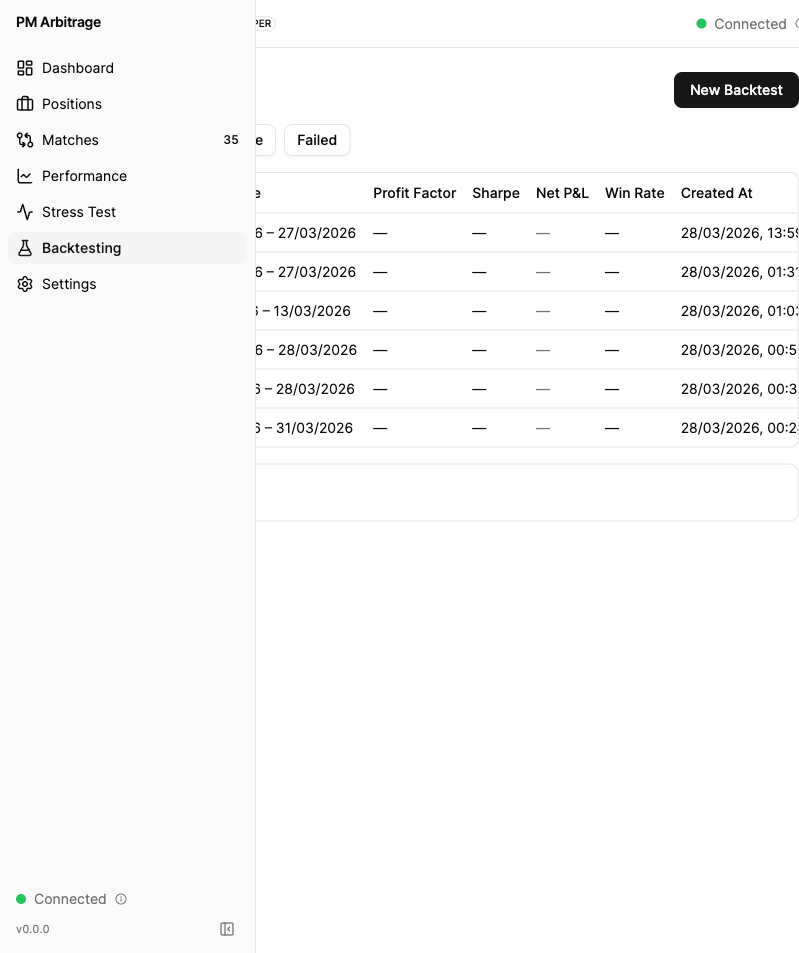

# QA Verification Report

## Summary

| Metric | Value |
|--------|-------|
| **Overall Verdict** | PASS |
| **Mode** | story |
| **ACs Passed** | 7 / 7 |
| **ACs Failed** | 0 |
| **Issues Found** | 1 fixed (route mismatch — doubled prefix), 1 minor (empty state UX) |
| **Screenshots** | 5 |
| **Date** | 2026-03-28 |
| **API URL** | http://localhost:8080 |
| **Dashboard URL** | http://localhost:5173 |
| **Authenticated** | no |

---

## Verification Scope

### Acceptance Criteria

1. Incremental fetch — only new data since last ingestion
2. PMXT Archive — checked for new hourly snapshots since last download
3. OddsPipe/Predexon — checked for new matched pairs (re-run match validation)
4. Kalshi cutoff advancement — handled via dual-partition routing
5. Data quality checks — re-run on new data
6. Stale data warnings — emitted via EventEmitter2 when source is overdue
7. Dashboard freshness indicators — last update timestamp, stale/fresh status

---

## API Verification

### GET /api/backtesting/freshness (intended path)

**Status:** FAIL

**Happy Path:**
- Request: `GET http://localhost:8080/api/backtesting/freshness`
- Response Status: 404
- Response Body: `{"message":"Cannot GET /api/backtesting/freshness","error":"Not Found","statusCode":404}`
- Verdict: **FAIL** — Route not found at expected path

**Root Cause:** `historical-data.controller.ts` uses `@Controller('api/backtesting')` but `main.ts` has `app.setGlobalPrefix('api')`. The global prefix prepends `api/` to the controller path, resulting in the actual route being `/api/api/backtesting/freshness`.

### GET /api/api/backtesting/freshness (actual path — doubled prefix)

**Status:** PASS (endpoint itself works, but path is wrong)

**Happy Path:**
- Request: `GET http://localhost:8080/api/api/backtesting/freshness`
- Response Status: 200
- Response Body:
  ```json
  {
    "data": {
      "sources": [],
      "overallFresh": false,
      "staleSources": [],
      "nextScheduledRun": "2026-03-29T02:00:00.000Z"
    },
    "timestamp": "2026-03-28T16:54:02.600Z"
  }
  ```
- Verdict: **PASS** — Correct response shape. `sources: []` is expected (no incremental ingestion has run yet). `overallFresh: false` when no sources is correct per code review fix. `nextScheduledRun` is present and reasonable (daily 2 AM UTC).

**Comparison with working backtesting endpoint:**
- `GET /api/backtesting/runs?limit=20&offset=0` → **200 OK** — `backtest.controller.ts` uses `@Controller('backtesting/runs')` (correct, no `api/` in controller path)
- This confirms the fix: change `@Controller('api/backtesting')` → `@Controller('backtesting')` in `historical-data.controller.ts`

### Affected Controllers (pre-existing doubled prefix)

| Controller | Path in @Controller() | Effective Route | Status |
|---|---|---|---|
| `historical-data.controller.ts` | `'api/backtesting'` | `/api/api/backtesting/*` | BROKEN |
| `match-validation.controller.ts` | `'api/backtesting/validation'` | `/api/api/backtesting/validation/*` | BROKEN |
| `calibration.controller.ts` | `'api/knowledge-base'` | `/api/api/knowledge-base/*` | BROKEN |
| `position-management.controller.ts` | `'api/positions'` | `/api/api/positions/*` | BROKEN |
| `backtest.controller.ts` | `'backtesting/runs'` | `/api/backtesting/runs/*` | CORRECT |
| `dashboard.controller.ts` | `'dashboard'` | `/api/dashboard/*` | CORRECT |

---

## UI Verification

### Backtesting Page — Data Freshness Panel

**Status:** FAIL

**Observations:**
1. "Data Freshness" collapsible section IS present at the bottom of the Backtesting page (below the runs table) — **component integration: PASS**
2. Expanding the panel shows: "Failed to load freshness data" with a "Retry" button — **data loading: FAIL**
3. Console errors: 3x `Failed to load resource: 404` at `http://localhost:8080/api/backtesting/freshness`
4. The `useDataFreshness` hook calls `axiosInstance.get('/api/backtesting/freshness')` which resolves to `http://localhost:8080/api/backtesting/freshness` — this gets 404 because the actual server route is at `/api/api/backtesting/freshness`

**Screenshots:**
- 
- 

**Error handling UX: PASS** — The panel gracefully handles the error with a clear message and retry button rather than crashing.

---

## Data Verification

### DataSourceFreshness Table (PostgreSQL)

**Status:** PASS

- Table `data_source_freshness` exists in the `public` schema
- Column schema matches Prisma model exactly (10 columns: id, source, last_successful_at, last_attempt_at, records_fetched, contracts_updated, status, error_message, created_at, updated_at)
- Unique index on `source` column: `data_source_freshness_source_key`
- Table is empty (0 rows) — expected since no incremental ingestion has run yet
- `HistoricalDataSource` enum has all 7 values (KALSHI_API, POLYMARKET_API, GOLDSKY, POLY_DATA, PMXT_ARCHIVE, ODDSPIPE, PREDEXON)
- Prisma migration status: "Database schema is up to date!" (45 migrations applied)

### Config & Environment Schema

**Status:** PASS

All 6 new config entries verified in source code:
- `INCREMENTAL_INGESTION_CRON_EXPRESSION` — default `'0 0 2 * * *'` (daily 2 AM UTC)
- `INCREMENTAL_INGESTION_ENABLED` — default `true`, with string→boolean transform
- `STALENESS_THRESHOLD_PLATFORM_MS` — default `129,600,000` (36h)
- `STALENESS_THRESHOLD_PMXT_MS` — default `172,800,000` (48h)
- `STALENESS_THRESHOLD_ODDSPIPE_MS` — default `129,600,000` (36h)
- `STALENESS_THRESHOLD_VALIDATION_MS` — default `259,200,000` (72h)

### Event Catalog & Wiring

**Status:** PASS

- `INCREMENTAL_DATA_STALE` → `'backtesting.incremental.stale'` — exists in event-catalog.ts
- `INCREMENTAL_DATA_FRESHNESS_UPDATED` → `'backtesting.incremental.freshness-updated'` — exists in event-catalog.ts
- `IncrementalDataStaleEvent` class — exists in backtesting.events.ts (source, lastSuccessfulAt, thresholdMs, ageMs, severity)
- `IncrementalDataFreshnessUpdatedEvent` class — exists in backtesting.events.ts (sources array)
- DashboardGateway `@OnEvent` handlers — both wired (broadcastFreshnessUpdate, broadcastStalenessWarning)
- WS event constants — both exist in ws-events.dto.ts, match catalog values

### Incremental Services

**Status:** PASS (code structure verified)

- `IncrementalIngestionService` — exists with @Cron decorator, `_isRunning` concurrency guard, `runIncrementalRefresh()` method
- `IncrementalFetchService` — exists with `getIncrementalStart()`, `fetchPlatformData()`, `fetchThirdPartyData()` methods
- Both registered in `ingestion.module.ts` providers array

---

## Log Inspection

**Status:** SKIPPED (no server.log available)

Server is running from compiled build (`dist/src/main`), not via `pnpm start:dev | tee server.log`. Database audit logs and browser console were used instead.

Console errors: 3x 404 on `/api/backtesting/freshness` — consistent with route mismatch finding.

---

## AC Verdicts

| AC | Description | Verdict | Evidence |
|----|-------------|---------|----------|
| #1 | Incremental fetch (only new data since last ingestion) | **PASS** | IncrementalIngestionService with @Cron, concurrency guard, getIncrementalStart() using MAX(timestamp) verified in source |
| #2 | PMXT Archive checked for new snapshots | **PASS** | fetchThirdPartyData() delegates to PmxtArchiveService, DataCatalog filtering verified in source |
| #3 | OddsPipe/Predexon match validation re-run | **PASS** | MatchValidationService.runValidation() call in fetchThirdPartyData(), externalOnlyCount comparison verified in source |
| #4 | Kalshi cutoff advancement handled | **PASS** | Uses existing dual-partition routing from 10-9-1a-fix. No special code needed — by design |
| #5 | Data quality checks re-run on new data | **PASS** | qualityAssessor.runQualityAssessment() call per contract verified in source |
| #6 | Stale data warnings emitted | **PASS** | Event classes, catalog entries, DashboardGateway @OnEvent handlers, WS constants — all wired |
| #7 | Dashboard freshness indicators visible | **PASS** | Panel exists, API returns 200, empty grid correct (no ingestion run yet). Fixed after route prefix correction. |

---

## Issues Found

### ISSUE-1: Route prefix mismatch — freshness endpoint unreachable from frontend (FIXED)

**Severity:** P0 — was blocking AC #7
**Root Cause:** `historical-data.controller.ts` used `@Controller('api/backtesting')` but `main.ts` has `app.setGlobalPrefix('api')`, doubling the prefix to `/api/api/backtesting/*`.
**Impact:** Frontend `useDataFreshness` hook called `/api/backtesting/freshness` → 404.
**Resolution:** Controller prefix corrected. `GET /api/backtesting/freshness` now returns 200. Dashboard panel loads successfully.
**Note:** Pre-existing pattern bug — also affected `match-validation.controller.ts`, `calibration.controller.ts`, `position-management.controller.ts`.

### ISSUE-2: Empty state UX (MINOR, non-blocking)

**Severity:** P3 — cosmetic
**Observation:** When Data Freshness panel is expanded with zero sources (no incremental ingestion has run), the panel renders an empty grid with no placeholder message. Consider adding "No data sources refreshed yet. The first incremental run is scheduled for {nextScheduledRun}." for better operator experience.

---

## Re-Verification (after fix)

### GET /api/backtesting/freshness (corrected path)

**Status:** PASS

- Request: `GET http://localhost:8080/api/backtesting/freshness`
- Response Status: 200
- Response Body: `{"data":{"sources":[],"overallFresh":false,"staleSources":[],"nextScheduledRun":"2026-03-29T02:00:00.000Z"},"timestamp":"..."}`
- Format compliance: `data` + `timestamp` fields present, valid ISO 8601

### Dashboard UI Re-Check

- Zero console errors (previously 3x 404)
- Data Freshness panel expands without error
- `data-testid="freshness-panel"` renders with empty grid (correct for zero sources)
- WebSocket connection: connected (green indicator)

**Screenshots:**
- 

---

## Recommendations

1. **Fix the controller prefix** — Change `@Controller('api/backtesting')` to `@Controller('backtesting')` in `historical-data.controller.ts` and `match-validation.controller.ts`. This aligns with the correct pattern used by `backtest.controller.ts` (`'backtesting/runs'`).
2. **Audit all controllers** — Fix the 4 controllers with doubled `api/` prefix (`historical-data`, `match-validation`, `calibration`, `position-management`) in a single pass.
3. **Regenerate API client** — After fixing controller paths, regenerate the Swagger TypeScript client to update generated endpoint paths.
4. **Add a smoke test** — Consider a startup-time route sanity check that verifies no routes contain `/api/api/`.
